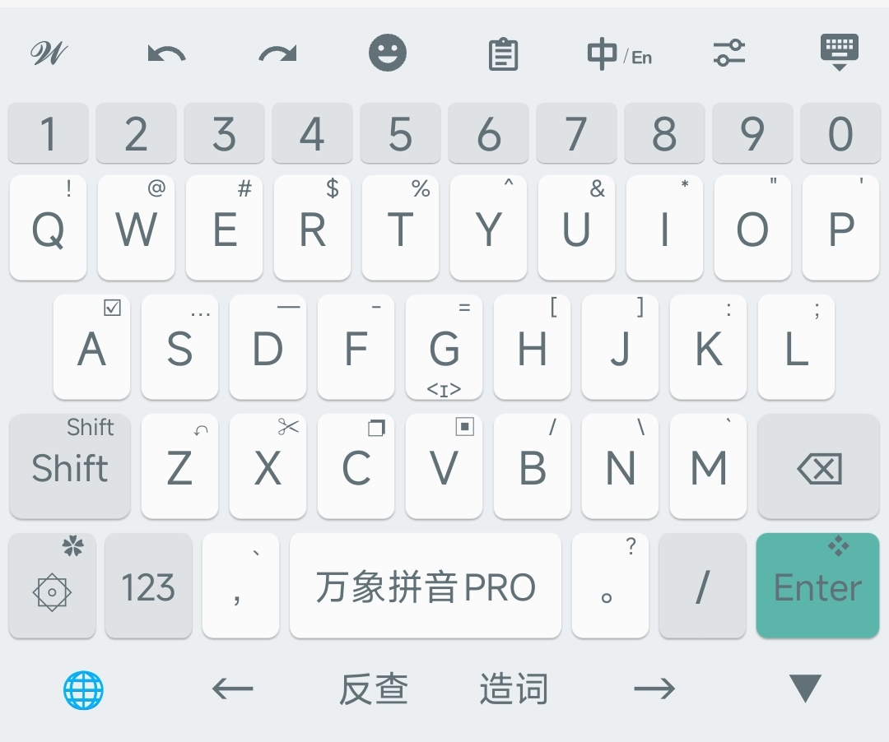
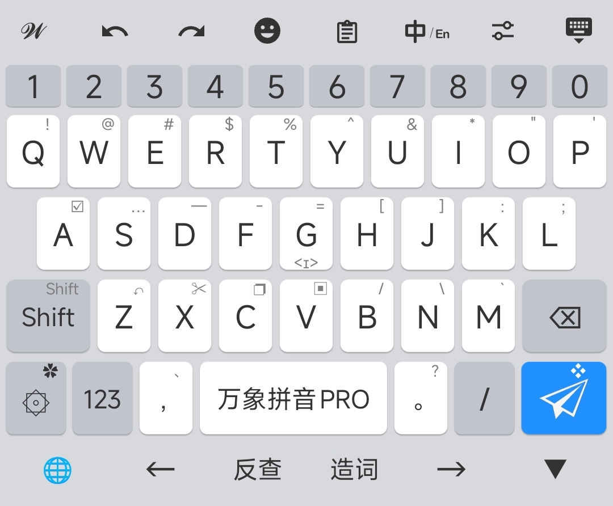
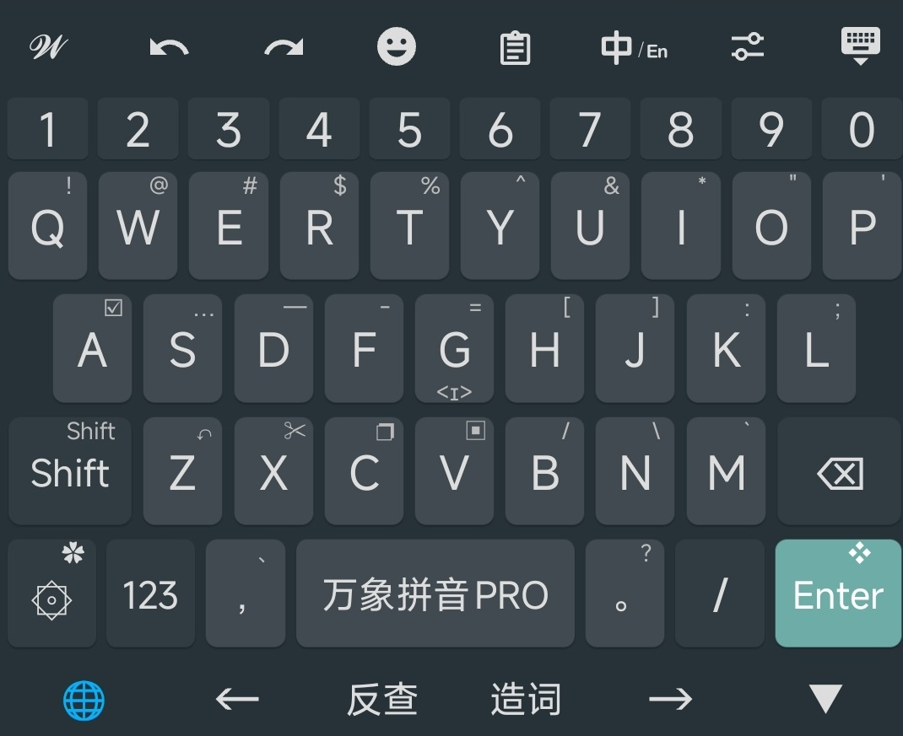

# 简纯+ 同文输入法主题

一款简洁美观的同文输入法主题，来自[万象输入方案](https://github.com/amzxyz/rime-wanxiang)仓库，在此基础上做调整，添加了底部功能栏，更适配全面屏手机操作，并支持 Shift 键长按锁定功能。

## 主题预览

### 简白


### 简蓝


### 简黑


## 配色方案

| 主题 | 说明 |
|------|------|
| 简白 | 浅色主题，清新明亮，适合日间使用 |
| 简蓝 | 蓝色主题，默认配色，经典耐看 |
| 简黑 | 深色主题，护眼舒适，适合夜间使用 |

## 功能特性

- 支持 26 键、14 键、18 键等多种键盘布局
- 内置数字键盘、符号键盘、Emoji 键盘
- 支持编辑模式，方便文本操作
- 底部功能栏优化，更适配全面屏操作
- Shift 键长按锁定，方便连续输入大写字母


## 安装方法

1. 下载 `简纯.zip` 文件
2. 解压到同文输入法的配置目录：
   - **内部存储**：`/storage/emulated/0/rime/`
3. 打开同文输入法，在「设置」→「主题」中选择「简纯+」
4. 在「配色方案」中选择喜欢的主题（简白/简蓝/简黑）

## 文件结构

```
简纯+/
├── 简纯+.trime.yaml    # 主题配置文件
├── backgrounds/         # 按键背景图片
│   ├── default/        # 简蓝主题背景
│   ├── google_black/   # 简黑主题背景
│   └── google_white/   # 简白主题背景
├── fonts/              # 字体文件
│   └── iconfont.ttf    # 图标字体
└── image/              # 主题预览图
```

## 键盘布局

- **26 键**：标准 QWERTY 布局
- **14 键**：精简布局，适合单手操作
- **18 键**：平衡布局，兼顾效率与空间

## 相关链接

- [万象输入方案](https://github.com/amzxyz/rime-wanxiang) - 本主题适配的输入方案
- [同文输入法](https://github.com/osfans/trime) - 安卓平台的 Rime 输入法

## 作者

amzxyz
