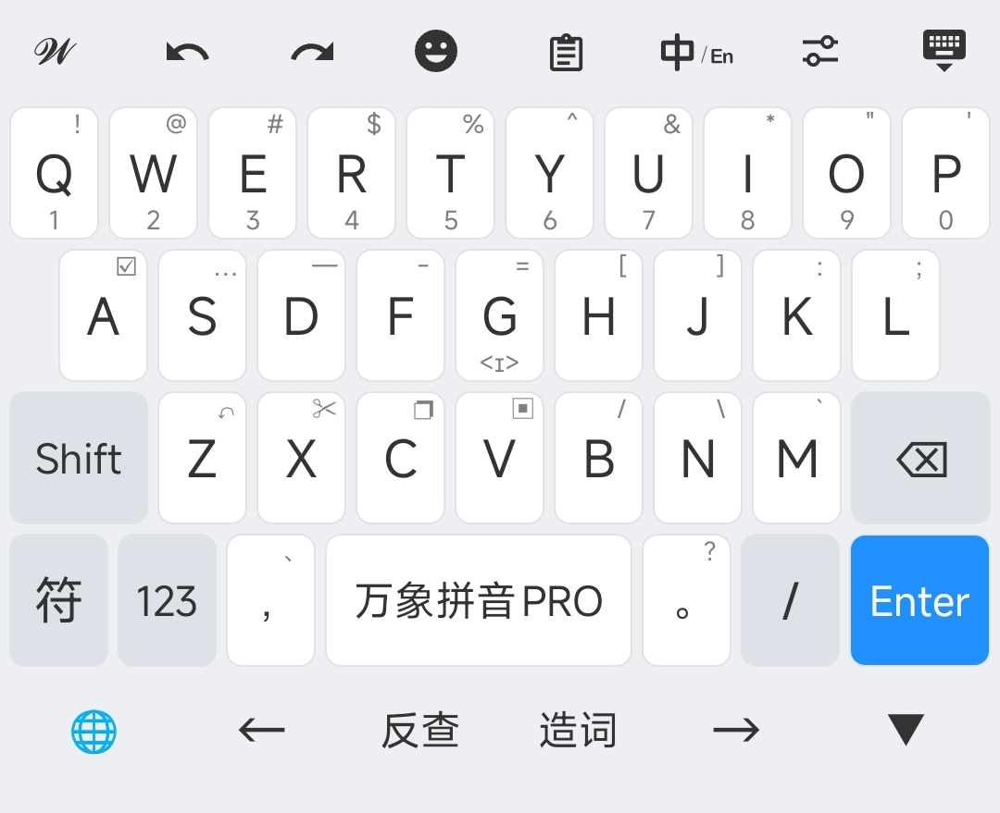
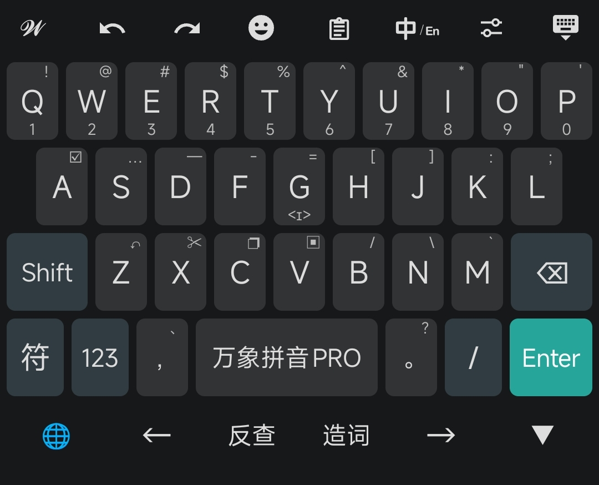

# 同文输入法主题

本仓库包含两款同文输入法主题：**简约** 和 **简纯+** 。

---

## 简约主题

一款极简风格的同文输入法主题，配色方案简洁纯粹。

### 主题预览

#### 皓月白


#### 焦炭黑


### 配色方案

| 主题 | 说明 |
|------|------|
| 皓月白 | 浅色主题，默认配色，清新明亮 |
| 焦炭黑 | 深色主题，护眼舒适，适合夜间使用 |

### 功能特性

- 支持 26 键、数字键盘、符号键盘、Emoji 键盘
- 底部功能栏，方便操作
- Shift 键长按锁定

### 安装方法

1. 下载 `简约.zip` 文件
2. 解压到同文输入法的配置目录：
   - **内部存储**：`/storage/emulated/0/rime/`
3. 打开同文输入法，在「设置」→「主题」中选择「简约」
4. 在「配色方案」中选择喜欢的主题（皓月白/焦炭黑）

---

## 简纯+ 主题

一款简洁美观的同文输入法主题，来自[万象输入方案](https://github.com/amzxyz/rime-wanxiang)仓库，在此基础上做调整，添加了底部功能栏，更适配全面屏手机操作，并支持 Shift 键长按锁定功能。

### 主题预览

#### 简蓝


#### 简黑


#### 简白


### 配色方案

| 主题 | 说明 |
|------|------|
| 简白 | 浅色主题，清新明亮，适合日间使用 |
| 简蓝 | 蓝色主题，默认配色，经典耐看 |
| 简黑 | 深色主题，护眼舒适，适合夜间使用 |

### 功能特性

- 内置数字键盘、符号键盘、Emoji 键盘
- 支持编辑模式，方便文本操作
- 底部功能栏优化，更适配全面屏操作
- Shift 键长按锁定，方便连续输入大写字母

### 安装方法

1. 下载 `简纯.zip` 文件
2. 解压到同文输入法的配置目录：
   - **内部存储**：`/storage/emulated/0/rime/`
3. 打开同文输入法，在「设置」→「主题」中选择「简纯+」
4. 在「配色方案」中选择喜欢的主题（简白/简蓝/简黑）

---

## 文件结构

```
trime-theme/
├── 简约.trime.yaml              # 简约主题配置文件
├── 简纯+.trime.yaml             # 简纯+主题配置文件（带底部功能栏）
├── 简纯+无底部栏.trime.yaml     # 简纯+主题配置文件（无底部功能栏）
├── backgrounds/                  # 简纯+按键背景图片
│   ├── default/                 # 简蓝主题背景
│   ├── google_black/            # 简黑主题背景
│   └── google_white/            # 简白主题背景
├── fonts/                        # 字体文件
│   └── iconfont.ttf             # 图标字体
└── image/                        # 主题预览图
```

## 配置说明

使用无底部栏版本时，可通过修改配置文件中的 `keyboard_padding_bottom` 值来调整底部空白区域的大小，以适配不同手机的全面屏手势区域。键盘高度可通过修改配置文件中的 `keyboard_height` 值来调整。底部功能栏的高度可通过搜索`key_back_color: keyboard_back_color`来定位，之后修改上面`height`的值来调整。

## 相关链接

- [万象输入方案](https://github.com/amzxyz/rime-wanxiang) - 简纯+主题适配的输入方案
- [同文输入法](https://github.com/osfans/trime) - 安卓平台的 Rime 输入法
